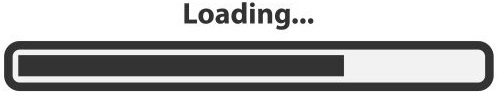

# Compass-UOL
Repositório que criei do programa de bolsas de React da Compass, que estou participando. Colocarei aqui alguns conteúdos que estou aprendendo e exercícios.

## Projetos
<ol>
<li><a href="/src/BarbeariaAlura">Barbearia Alura</a></li>
<li><a href="/src/FlexBlog">FlexBlog</a></li>
<li><a href="/src/reactFormChallenge"> React Form</a></li>
<li><a href="/src/Lista de presença">Lista de presença</a></li>
<li><a href="/src//Compass Logon">Compass Logon</a></li>
</ol>

 <h2>Certificados</h2>
 &ensp; 

#### Clique aqui ⬇

